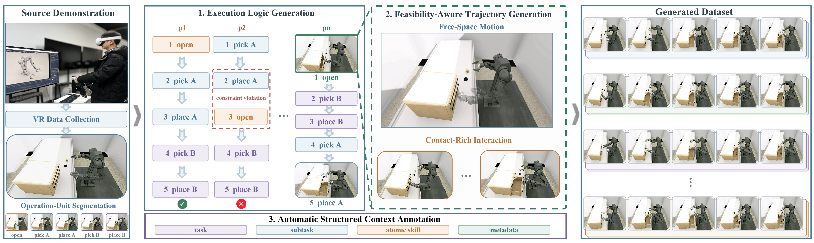
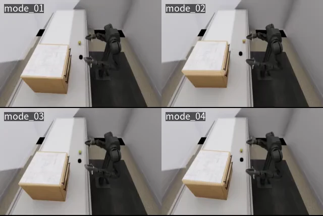
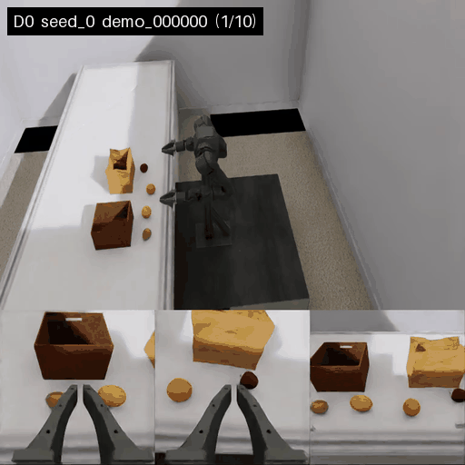
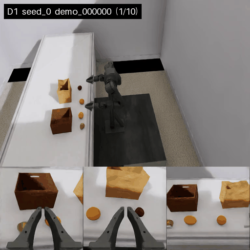
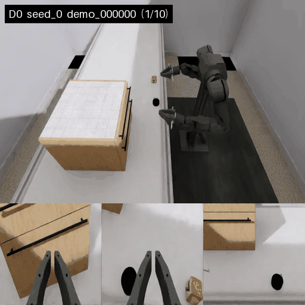
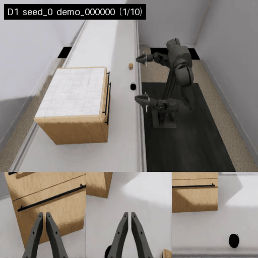

<div align="center">

# ELogGen

### Synthesizing Diverse and Context-Rich Data for Robot Learning From a Single Demonstration via Execution Logic

**From a single demonstration to diverse, feasible, and context-rich data for robot learning.**

[Demo](#demo) · [Results](#results) · [Installation](#installation) · [Quick Start](#quick-start)

</div>

<p align="center">
  
</p>

## Overview

Collecting diverse robot data is costly, particularly for long-horizon bimanual manipulation, while existing generation methods mainly expand geometric variation and often retain the fixed execution structure of the source demonstration. As a result, their behavioral coverage can remain limited even when object poses, scene layouts, or robot configurations are varied.

**ELogGen** synthesizes diverse and context-rich data for robot learning from a single source demonstration by reorganizing reusable operation units under task and feasibility constraints. It introduces **execution logic** as a new axis of data diversity, varying **operation order**, **semantic role binding**, and **effector assignment** under the same final goal.

ELogGen couples execution-logic generation with **feasibility-aware trajectory generation** to instantiate alternative task executions across diverse spatial configurations. Because the generation process explicitly preserves the correspondence between execution logic, operation units, and robot motion, **multi-level, temporally aligned structured context is produced as an inherent output of generation rather than as a separate post-hoc annotation step**.

### Highlights

- **Diverse and context-rich data synthesis:** expand one source demonstration into a dataset of valid long-horizon task executions that broadens behavioral and geometric coverage and can complement a limited real-data budget.
- **Execution logic generation with physical feasibility:** systematically vary **operation order**, **semantic role binding**, and **effector assignment**, then instantiate the resulting executions across diverse spatial configurations with feasibility-aware trajectory generation.
- **Structured context by construction:** preserve semantic-temporal correspondences throughout synthesis and automatically yield multi-level, temporally aligned supervision for every generated demonstration.

## Demo

ELogGen synthesizes diverse and context-rich robot data from a single source demonstration. The two long-horizon bimanual simulation tasks below visualize the generated execution-logic coverage.

### Category Packing — 24 modes

<p align="center">
  
</p>

### Drawer Storage — 4 modes

<p align="center">
  
</p>

## Results

Generation success rates under the evaluated initialization perturbation settings are summarized below.

| Task | Perturb. | Attempts | Succ. rate (%) |
| --- | --- | ---: | ---: |
| Category Packing | D0 | 3 × 100 | 96.7 ± 3.2 |
| Category Packing | D1 | 3 × 100 | 79.3 ± 5.0 |
| Drawer Storage | D0 | 3 × 100 | 98.0 ± 1.0 |
| Drawer Storage | D1 | 3 × 100 | 69.0 ± 4.6 |

### Initialization perturbations

**D0** applies translational perturbations only to the manipulated objects. **D1** introduces larger-range position and orientation perturbations to both objects and targets, together with perturbations to the robot's initial joint configuration.

| Category Packing — D0 | Category Packing — D1 |
| --- | --- |
|  |  |

| Drawer Storage — D0 | Drawer Storage — D1 |
| --- | --- |
|  |  |

## Installation

### Requirements

Linux x86-64, an NVIDIA GPU with an Isaac Sim 4.5-compatible driver, Conda, Git, and standard Linux build tools.

### 1. Clone and create the environment

```bash
git clone https://github.com/USTC-AIR-Lab/ELogGen.git
cd ELogGen
conda env create -f environments/eloggen-base.yaml
conda activate eloggen
```

### 2. Install the runtime

```bash
bash setup.sh
source scripts/activate_env.sh
```

Use `bash setup.sh --data-root /path/to/storage/ELogGen` if large third-party resources should live outside the repository.

### 3. Install OpenArm resources

```bash
eloggen resources install openarm \
  --dataset-root "$ELOGGEN_DATASET_ROOT"
```

OpenArm robot model files are available from [ElogGen-Assets](https://huggingface.co/datasets/Nano-Ping/ElogGen-Assets). The resource installer downloads and verifies them.

### 4. Validate the environment

```bash
bash scripts/validate_environment.sh
```

<details>
<summary><b>Tested environment</b></summary>

| Component | Version / source |
| --- | --- |
| Python | 3.10 |
| Isaac Sim | 4.5.0 |
| OmniGibson | 3.7.1-compatible pinned BEHAVIOR-1K source |
| CUDA toolkit | 12.4 |
| PyTorch | 2.6.0 + cu124 |

</details>

## Quick Start

ELogGen currently provides three task interfaces:

| Task | Interface name |
| --- | --- |
| Category Packing | `openarm_fruit_basket_bagging` |
| Drawer Storage | `openarm_drawer_storage` |
| Fixed-base OpenArm experiment | `openarm_real_exp_1` |

Use the interface name as the task argument in the CLI commands below.

Check a task pack:

```bash
python -m eloggen.cli check openarm_real_exp_1
```

Generate one demonstration:

```bash
python -m eloggen.cli generate openarm_real_exp_1 \
  --difficulty D0 \
  --order task_spec \
  --num-demos 1 \
  --seed 1 \
  --no-headless \
  --folder runs/openarm_real_exp_1/generated_hdf5 \
  --run-dir runs/openarm_real_exp_1/test_D0
```

Common controls include `--difficulty`, `--order` / `--subtask-order`, `--num-demos`, `--seed`, and `--output-format`.

For the full CLI:

```bash
python -m eloggen.cli generate --help
python -m eloggen.cli pipeline --help
```


## Acknowledgements

ELogGen builds on the open-source robotics ecosystem. We thank the developers and contributors of [MoMaGen](https://github.com/ChengshuLi/MoMaGen), [BEHAVIOR-1K](https://github.com/StanfordVL/BEHAVIOR-1K), [OmniGibson](https://github.com/StanfordVL/OmniGibson), [cuRobo](https://github.com/NVlabs/curobo), [robomimic](https://github.com/ARISE-Initiative/robomimic), and [LeRobot](https://github.com/huggingface/lerobot) for making their projects publicly available.
